Answers to common questions about when and why to use Gemara. For hands-on creation guides, see the [Tutorials](../tutorials/).

## Getting Started

### What's the minimum I need to do something useful?

Start with artifacts in Layers 1 & 2.
Those are required imports into Layer 3 artifacts (Policy) and Layers 5-7 (Evaluation, Enforcement, Audit).
However, you do not need artifacts at every layer to get value. A Control Catalog (Layer 2) is immediately useful on its own.

### Which layer do I start with?

Layers are separated by activity or job to be done, not sequential steps. Below is an example of where a layer may line up with job function:

| **Layer** | **Who** | **Job** |
|:--|:--|:--|
| 1 | Standards bodies, governance teams, industry groups | Publish frameworks, standards, and best practices |
| 2 | Security engineers, project teams | Threat model and write testable controls |
| 3 | Policy owners, risk managers | Decide what applies to *their* organization |
| 5-7 | Tools and audit teams | Evaluate, enforce, and audit compliance |

### Do I need to learn CUE to use Gemara?

No. As a user, you write YAML and validate it. The CUE schemas are the source of truth for validation, but you don't need to author CUE.

```bash
cue vet -c -d '#ControlCatalog' github.com/gemaraproj/gemara@latest your-controls.yaml
```

If you use an AI code assistant, Gemara provides MCP tools to help your agent validate artifacts directly.

## Example: Securing an Open Source Project

This walkthrough follows a single scenario, securing an open source project hosted in Git, through every Gemara layer.

```mermaid
graph LR
    subgraph L1["Layer 1: Guidance & Vectors"]
        NIST["NIST SSDF<br/>Guidance Catalog<br/><i>How software should be made</i>"]
        MITRE["MITRE ATT&CK<br/>Vector Catalog<br/><i>How attackers target supply chains</i>"]
    end

    subgraph L2["Layer 2: Controls & Threats"]
        OSPS["OSPS Baseline<br/>Control Catalog<br/><i>Testable controls for open source projects</i>"]
        THREATS["Threat Catalog<br/><i>What specifically can go wrong in open source projects</i>"]
    end

    subgraph L3["Layer 3: Policy"]
        POLICY["Organizational Policy<br/><i>Our projects must comply with OSPS Baseline</i><br/>Scope: all public repos · Frequency: weekly"]
    end

    subgraph L4["Layer 4: Your Project"]
        PROJECT["Git repo + CI/CD + infrastructure<br/><i>Existing tooling — Gemara doesn't schema this</i>"]
    end

    subgraph L5["Layer 5: Evaluation"]
        EVAL["Evaluation Log<br/>Scanner checks repo against policy controls<br/>Result: branch protection missing ✗"]
    end

    subgraph L6["Layer 6: Enforcement"]
        ENFORCE["Enforcement Log<br/>Tooling enables branch protection automatically<br/>Action: remediated ✓"]
    end

    subgraph L7["Layer 7: Audit"]
        AUDIT["Audit Log<br/>Auditor reviews: policy existed, evaluation<br/>found gap, enforcement remediated, passing since"]
    end

    NIST -->|informs| OSPS
    MITRE -->|maps to| THREATS
    THREATS -->|informs| OSPS
    OSPS -->|imported by| POLICY
    POLICY -->|applied to| PROJECT
    PROJECT -->|evaluated by| EVAL
    EVAL -->|triggers| ENFORCE
    ENFORCE -->|reviewed by| AUDIT
```



Who does what in this scenario:

- Standards bodies and industry groups publish Layer 1 artifacts. You consume them.
- The OSPS Baseline SIG publishes the Layer 2 Control Catalog. You consume it.
- Your governance body writes the Layer 3 Policy importing OSPS Baseline.
- Your project is Layer 4. It exists as-is.
- A scanner from the [awesome-gemara](https://github.com/gemaraproj/awesome-gemara) ecosystem evaluates your repo and produces Layer 5-6 artifacts.
- An auditor reviews the full chain at Layer 7.

Most users enter at Layer 2 (consuming controls) or Layer 3 (writing policy). You don't build every layer; you build your part and connect to the rest.

## Understanding the Artifacts

### What's the difference between a Guidance Catalog and a Control Catalog?

Guidance is broad. It applies across technologies.
Controls are specific, actionable, and assessable for a particular technology or scope.

The test: if you can't write testable conditions for it, it's not a control.

| | **Guidance (Layer 1)** | **Control (Layer 2)** |
|:--|:--|:--|
| Example source | OWASP Top 10 | Open Source Project Security Baseline |
| Scope | Any technology | Specific technology |
| Testable | No | Yes, has Assessment Requirements |
| Says | "Implement proper access controls" | "Official releases MUST be signed or include a signed manifest with cryptographic hashes" |

### What are Mapping Documents for?

Inline mappings in a catalog express author intent: "I wrote this control and it was informed by this guidance." They depict simple object relationships.

Mapping Documents are a separate artifact where anyone (author or consumer) can map atomic units between catalogs with more fidelity. Consumers may disagree with a producer's mappings or want to add mappings without modifying the original catalog. Mapping Documents enable that without forking the source.

### What is Layer 4 and why is there no schema?

Layer 4 is symbolic. It represents the actual deployment and operation of systems, covered by existing ecosystems (Kubernetes, CI/CD pipelines, SBOM generators).

Layer 4 takes inputs from the Definition Layers (1-3), introduces risk, and produces measurable data (like SBOMs) that become inputs to Layers 5-7. Gemara doesn't schema this because the ecosystem itself *is* Layer 4.

### Are Evaluation/Enforcement/Audit Logs hand-authored or tool-produced?

Typically tool-produced. A policy engine or scanner produces Evaluation Logs, including structured evidence of what it observed (API responses, config files, test results). Enforcement Logs are generated by tools that block or remediate non-compliant resources.

Some controls are procedural, so those logs can be human-authored. Audit Logs are typically human-produced: an auditor's interpretation of a resource's compliance with criteria, citing evaluation and enforcement artifacts as evidence.

## Gemara and OSCAL

### How does Gemara relate to OSCAL?

OSCAL is a mature standard for machine-readable compliance documents, adopted in programs like FedRAMP. Gemara builds on lessons from the OSCAL community and optimizes for a specific workflow: lean YAML authoring, machine-generated artifacts at scale, and first-class threat-to-control traceability. The Gemara SDK exports to OSCAL formats, so organizations can use Gemara for authoring and automation while producing OSCAL artifacts for exchange and regulatory submission.

### When should I use OSCAL vs Gemara?

There is real overlap. Both handle catalogs, assessment data, and policy. The difference is what each optimizes for:

| **Gemara optimizes for** | **OSCAL optimizes for** |
|:--|:--|
| Lean YAML authoring with minimal boilerplate | Comprehensive, self-contained documents |
| Threat-to-control traceability as a first-class schema concept | First-class system and component modeling (SSP, component definitions) |
| Tool-to-tool data flow (scanner results, enforcement actions) | Aggregating compliance posture across system components |
| Each artifact validates independently | Enforced artifact chain (catalog, profile, SSP, assessment plan, results) |

As a practical example: if a project wants to check whether it conforms to the OSPS Baseline, an evaluator that supports Gemara can produce an Evaluation Log that references the Control Catalog directly. In OSCAL, the same check requires creating a catalog, a profile, an SSP, and an assessment plan before you can produce assessment results. OSCAL's chain exists for good reasons (formal authorization, traceability across organizational boundaries), but it's more infrastructure than many projects need for day-to-day evaluation.

If you're exchanging compliance data between organizations or submitting to a regulator, OSCAL is the established format. Many organizations will use both.

### How do I get from Gemara to OSCAL?

The SDK maps Gemara artifacts to their OSCAL equivalents and handles OSCAL-specific requirements like UUID generation. Your source YAML stays lean; the SDK produces the OSCAL output.

```go
oscalCatalog, _ := gemaraconv.ControlCatalog(catalog).ToOSCAL()
```

## Adopting Gemara

### Do I have to start from scratch?

No. Each schema is valuable on its own and you can adopt incrementally. If you have controls in a spreadsheet, that's a great first transformation into a Control Catalog. Threat models can come next. Your existing tooling stays as-is. Gemara describes the relationships between them, it doesn't replace them.

### Do I write my own Control Catalog or reuse existing ones?

Start by reusing. Gemara has a growing ecosystem of open source control catalogs:

- OSPS Baseline, for open source components you consume
- FINOS CCC, for cloud infrastructure in financial services

If an existing catalog covers 80% of your needs, import it into your policy and tailor it. If you find a gap specific to your platform, extend it with an internal catalog or contribute back to the upstream project.

### Can I use different controls for different systems?

Yes. Policy scoping handles this. Your high-sensitivity systems (payments, auth) can import the full control catalog. Internal tooling can import a subset. Each policy defines its own scope (technologies, groups, regions, sensitivity levels) so tooling can programmatically determine which controls apply where.

### How do I migrate existing policies?

You're still writing prose, just structured and in YAML. A 20-page Word policy becomes a Gemara Policy document with defined scope, imports, and adherence sections. The substance is the same; the structure makes it machine-readable.

AI tooling can help. The Gemara MCP Server assists agents with migrations.

## Working Across Teams

### Who typically owns what?

A common ownership pattern:

| **Role** | **Typical Responsibility** | **Gemara Layer** |
|:--|:--|:--|
| GRC / Compliance | Policy, framework mappings, risk appetite | 3 |
| Security Engineering | Controls, threat models, evaluation checks | 2, 5 |
| Platform / DevOps | The systems under assessment (existing tooling) | 4 |
| Auditor | Interpretation of evidence against criteria | 7 |

Your organization may divide this differently. The key principle: the GRC team owns the "why" and "what maps where," engineering owns the "how to prove it." Neither needs to be an expert in the other's domain.

### What does the auditor actually see?

Present the policy to demonstrate you have procedures and technical requirements accounted for and are actively managing risk. Show what you're assessing, with what engine, how frequently, and the outputs over time. Specifically:

1. Layer 3 Policy, demonstrating procedure, scope, and risk management
2. Layer 5 Evaluation Logs, demonstrating continuous assessment, results over time, and the evidence collected
3. Layer 6 Enforcement Logs, demonstrating remediation when controls fail

Evaluation Logs carry structured evidence. Each assessment can record when evidence was gathered and what was observed. The auditor doesn't need to chase separate raw artifacts; the evidence chain is in the logs.

### How do evaluation tools connect to Gemara?

Your existing tools stay as-is. You may need glue code so they produce Evaluation Logs in the Gemara schema, or you can use tools in the Gemara ecosystem that already integrate.

Each evaluation result references an assessment requirement ID from the imported Control Catalog and can carry structured evidence of what the tool observed. The full chain traces back: threat, control, assessment requirement, evaluation (with evidence), enforcement.

## Publishing and Distribution

### How do I publish my artifacts?

You can publish artifacts as release artifacts in your repository. The project is also standardizing on a Gemara bundle spec based on OCI artifacts to make scaled consumption and publishing easier.
